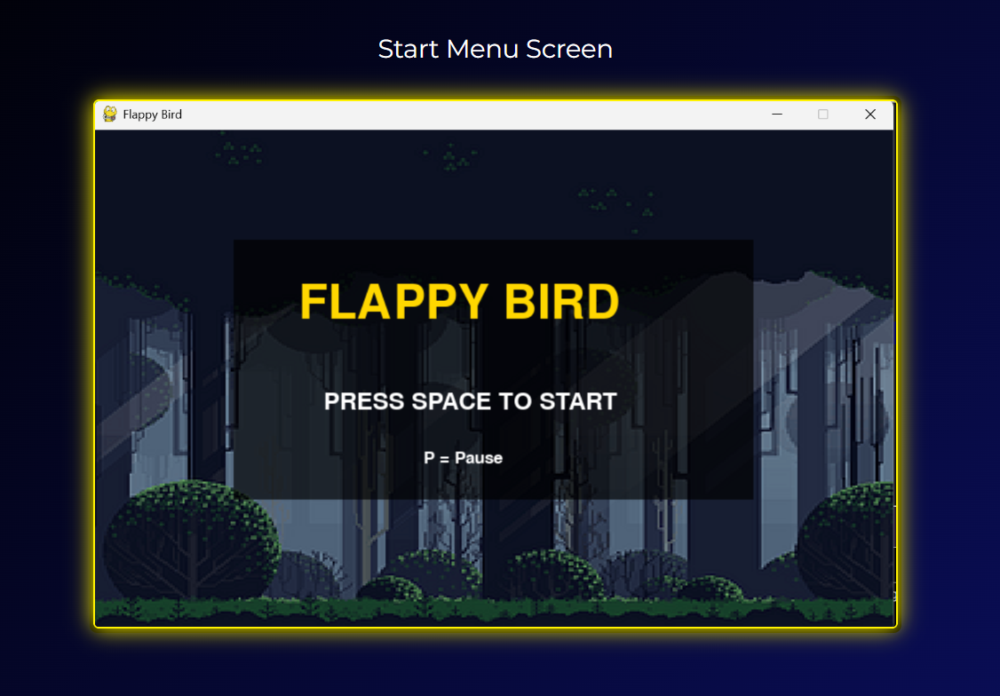
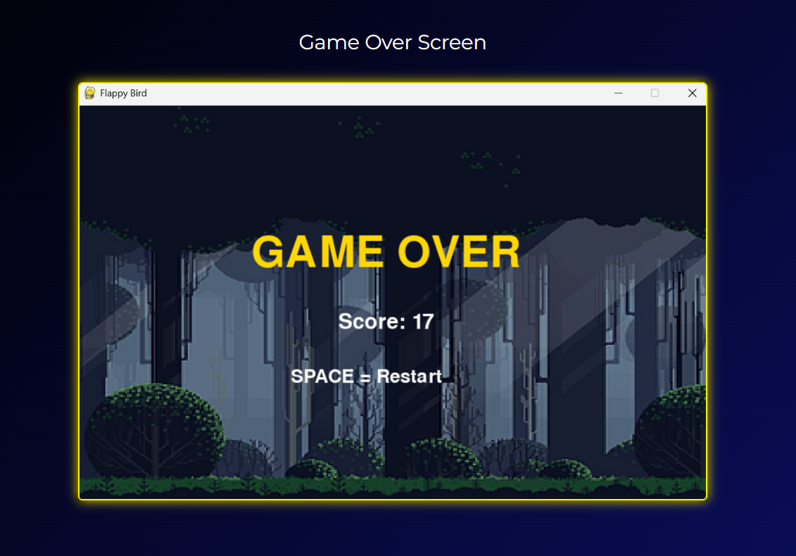
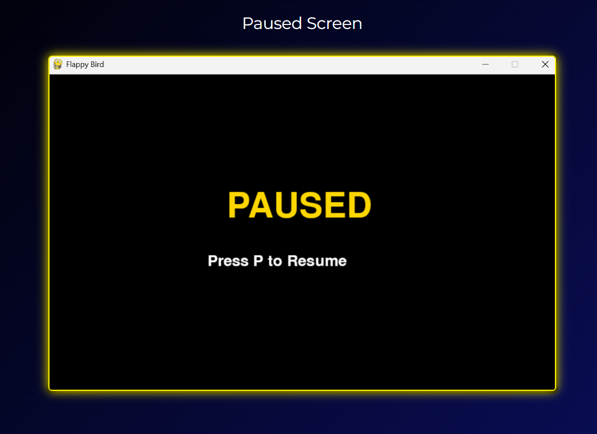
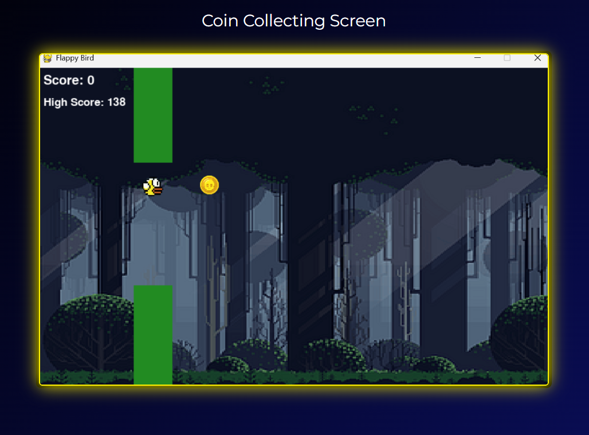

<div align="center">


</div>

---

## 🎯 Overview

A modern reimagining of the classic **Flappy Bird** arcade game — built from scratch in **Python** using **PyGame**. Navigate a bird through procedurally generated pipes, collect shiny coins for bonus points, and compete against your own high score. Smooth physics, sprite animations, background music & sound effects bring the retro experience to life.

---

## 🎬 Game Preview

<div align="center">

| 🏁 Start Menu | 🎮 Gameplay | 💀 Game Over |
|:---:|:---:|:---:|
|  |  |  |

| ⏸️ Pause Screen | 🪙 Coin Collect |
|:---:|:---:|
|  |  |

</div>


---

## ✨ Features

<table>
<tr>
<td width="50%" valign="top">

### 🐤 Core Gameplay
- 🕊️ Smooth flap physics with gravity & velocity
- 🏗️ Procedurally generated pipes (random heights)
- 🪙 Collectible coins (+5 bonus points each)
- 📈 Persistent high score tracking
- 🎨 Animated bird sprite (2-frame wing flap)

</td>
<td width="50%" valign="top">

### 🎧 Audio & Experience
- 🎵 Looping background music
- 🔊 Game over sound effect
- ⏸️ Pause / resume anytime (P key)
- 🖥️ Clean dark-themed menus
- 🚀 60 FPS smooth gameplay loop

</td>
</tr>
</table>

---

<div align="center">

</div>

## 🛠️ Tech Stack

<div align="center">

</div>

| Layer | Technology |
|---|---|
| Language | Python 3.10+ |
| Game Framework | PyGame 2.5 |
| Audio | `pygame.mixer` (`.wav` / `.mp3`) |
| Graphics | Custom sprites + `pygame.transform` |

---

## 🚀 Getting Started

**1. Clone the repo**
```bash
git clone https://github.com/yourusername/flappy-bird-pygame.git
cd flappy-bird-pygame
```

**2. Install PyGame**
```bash
pip install pygame
```

**3. Run the game**
```bash
python main.py
```

> **Controls:** `SPACE` to flap / restart · `P` to pause

---

## 🏗️ Project Structure

```
flappy-bird-pygame/
├── assets/               # Game assets
│   ├── background.png    # Scrolling background
│   ├── coin.png          # Collectible coin sprite
│   ├── flap1.png         # Bird frame 1
│   ├── flap2.png         # Bird frame 2
│   ├── game_over.wav     # Game over SFX
│   └── music.mp3         # Background music
├── screenshots/          
│   ├── start_menu.png
│   ├── gameplay.png
│   ├── game_over.png
│   ├── pause_screen.png
│   └── coin_collect.png
├── main.py               # 🎮 Entry point — all game logic
└── README.md             # 📖 You're here
```

---

## 🧠 How It Works

| Concept | Implementation |
|---|---|
| **Bird Physics** | Gravity `0.4` + Jump `-8` velocity — smooth arc motion |
| **Pipe Spawning** | Random height `80–300px` with fixed `190px` gap |
| **Coin System** | Spawns at random Y; +5 score on collision; resets off-screen |
| **Collision** | `pygame.Rect.colliderect()` for bird vs pipes / screen bounds |
| **Game States** | `start_menu()` → `main()` → `game_over()` → loop |

---

## 📈 Roadmap

- [ ] Increasing difficulty (faster pipes over time)
- [ ] Particle effects on coin collect
- [ ] Power-ups (shield, magnet, slow-mo)
- [ ] Mobile touch input support
- [ ] Leaderboard with local scores

---

<div align="center">

### ⭐ Star this repo if you love retro arcade games!


</div>
